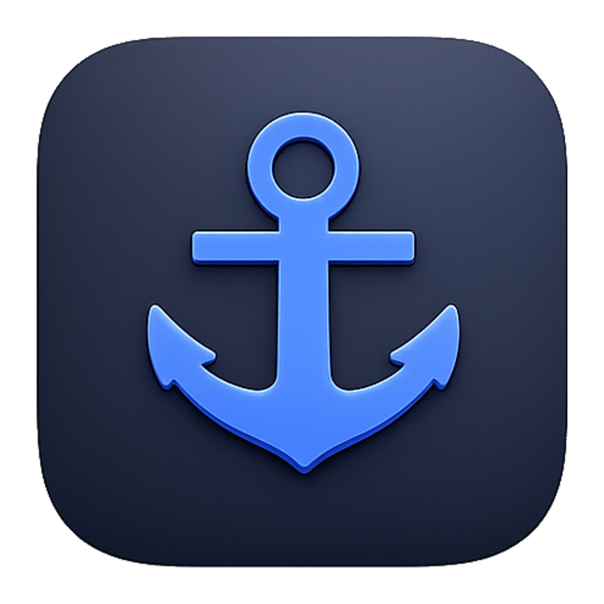
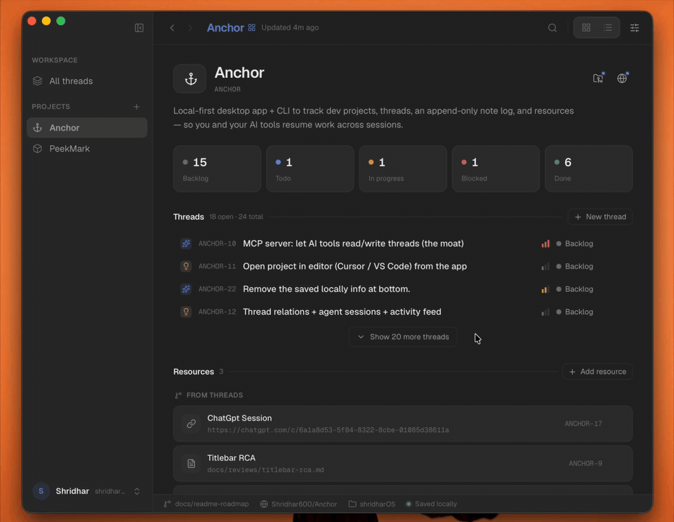

<div align="center">
  
  <h1>Anchor ⚓</h1>
  <p><strong>Stay in sync with your AI coding agents — and never lose the thread between sessions.</strong></p>

  <p>
    <a href="LICENSE"></a>
    
    <a href="https://github.com/Shridhar600/Anchor/actions/workflows/ci.yml"></a>
    
  </p>
</div>

---

You've got a handful of side projects going, each built with an AI agent. You start one late at
night, ship a burst of work, and move on. A week later you open it back up and — *wait, what was
I even doing here?* Right now, the only way to find out is scrolling back through old agent chats.

**Anchor is where that context lives instead.** Have your agent log a checkpoint as it works;
come back, read the last checkpoint, and pick up right there — across all your projects, without
re-reading a single chat session.

> 🚧 **Early & evolving.** The desktop app and CLI work today. Dashboards, an **MCP server**,
> **agent skills**, and **linking threads to your agent's chat sessions** are next. See the
> **[Roadmap](ROADMAP.md)**.

<div align="center">
  
  <br/><em>A project at a glance — threads, progress, and where you left off.</em>
</div>

## How it works

- **Your agent logs as it works.** Through the `anchor` CLI it opens threads, logs progress, and
  drops checkpoints while it codes — no copy-pasting from chat.
- **You steer from the app.** The desktop UI shows everything live; reprioritize, add your own
  notes, see what's next.
- **Either side resumes instantly.** Open a thread and the latest **checkpoint** tells you exactly
  where you (or the agent) left off.

## What you get

- **Projects & threads** — group your work into projects and threads (tickets / tasks).
- **Progress log** — each thread logs progress over time; you or your agent add entries as work happens.
- **Checkpoints** — mark “where we left off”; the latest is pinned so resuming is instant.
- **Board & command palette** — kanban by status, ⌘K for everything, calm dark-first UI.
- **A real CLI** — the `anchor` binary drives the same data, with `--json` for agents and scripts.
- **Runs locally** — SQLite on disk; your project data stays on your machine.

## Build & run

Requires a [Rust toolchain](https://rustup.rs/) and [pnpm](https://pnpm.io/).

```sh
pnpm install
pnpm tauri dev                    # desktop app (dev)
cargo install --path anchor-cli   # CLI → `anchor` on your PATH
```

## Anchor for agents

Point your agent at the `anchor` CLI — it's how the agent reads and writes Anchor while it works:

```sh
anchor project add --key ANCHOR --name "Anchor" --path . --remote github.com/you/repo
anchor thread add --project ANCHOR --title "Wire up the MCP server" --type feature --priority high
anchor note add --thread ANCHOR-1 --kind checkpoint --body "Stubbed server; next: list_threads."
anchor thread list --project ANCHOR     # threads grouped by status
anchor thread show ANCHOR-1             # detail + progress log
```

Add `--json` for machine-readable output, and `--actor <name>` to attribute who did what.

## Architecture

Cargo workspace + a Tauri v2 desktop app:

- **`anchor-core`** — Rust data layer: SQLite, versioned migrations, integrity enforced in code.
- **`anchor-cli`** — the `anchor` binary: the surface your agents and scripts drive.
- **`src-tauri` + `src/`** — desktop app: Rust backend (Tauri commands over `anchor-core`) + React/TypeScript UI.

## Project

- **Roadmap** → [ROADMAP.md](ROADMAP.md) · what's shipped and what's next.
- **Contributing** → [CONTRIBUTING.md](CONTRIBUTING.md) · issues + PRs welcome; open an issue first for anything non-trivial.
- **Changelog** → [CHANGELOG.md](CHANGELOG.md).
- **License** → [MIT](LICENSE) © 2026 Shridhar600.
